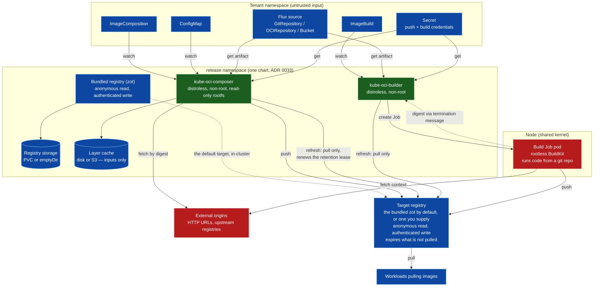
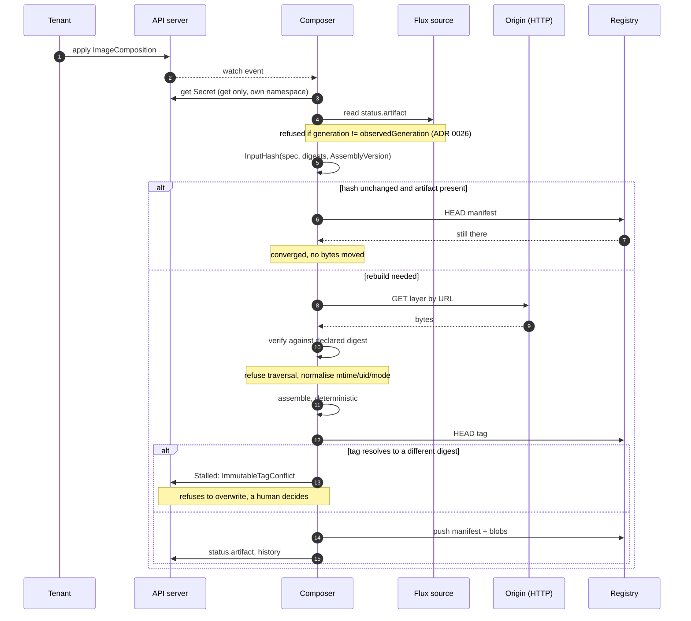
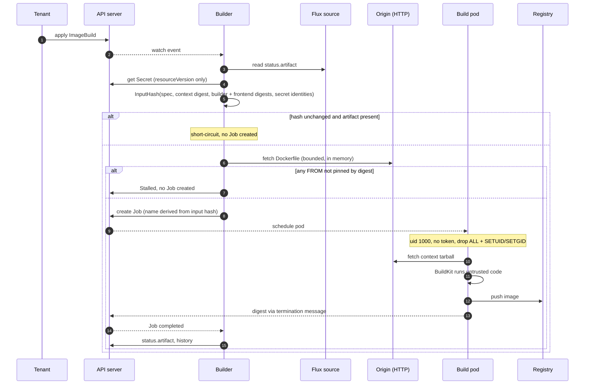

# Threat model

STRIDE over the two components this project ships. Written against the code, not against an
intended design: every claim below names the file that makes it true, so it can be checked and so it
rots visibly when the code moves.

Scope is what this repository controls. The registry, the Flux source controllers, the container
runtime and the cluster's own admission policy are dependencies with their own models; where a
guarantee actually rests on one of them, that is stated rather than assumed.

## Components and trust boundaries

The two components are deliberately separate: separate binaries, charts and RBAC
([ADR 0004](adr/0004-two-kinds-two-controllers.md)). Installing the composer does not install the builder,
and the composer's role cannot create a single object.



The boundaries that matter:

| Boundary | Crossing | Why it matters |
|---|---|---|
| **Tenant → controller** | A spec is written by anyone with `create` on the CRD | Spec fields become URLs fetched, images pulled, and Jobs run |
| **Origin → controller** | Fetched tarballs, pulled base images | Attacker-controlled bytes parsed in-process |
| **Controller → build pod** | A Job running BuildKit | The pod executes arbitrary code from a git repository |
| **Registry → consumer** | A pull, by any client that can reach the registry | Anonymous by default, so reachability is the access control (I5) |
| **Namespace → namespace** | `sourceRef.namespace` | The one place a tenant reaches outside its own namespace |

## The core invariant, and what it buys

`output digest = f(spec)` for `ImageComposition`. Assembly pins mtimes to epoch, forces empty
`uname`/`gname`, normalises modes, sorts entries with `sort.SliceStable`, and discards source-side
gzip metadata (`internal/oci/assemble.go`, `internal/oci/extract.go`).

Security consequence: **content cannot change without the spec changing**, so review of the spec is
review of the artifact. `publish.onConflict: Fail` (the default) refuses to move a tag that already
resolves to different bytes — which is what caught a real incident where a tag was published holding
a previous revision's content ([ADR 0026](adr/0026-a-source-artifact-can-lag-its-own-spec.md)).

For `ImageBuild` the invariant is weaker by construction: the output is an *observation*, not a
function of the spec ([ADR 0025](adr/0025-dockerfile-builds-as-a-second-kind.md)). Rebuilds do
reproduce for builds whose steps are themselves deterministic ([ADR 0027](adr/0027-what-rootless-buildkit-actually-needs.md)),
but a `RUN` that installs packages or reads the clock can still differ. The tag-conflict guard is
therefore load-bearing rather than decorative for this kind — and it did not exist on this kind at
all until [ADR 0029](adr/0029-three-valued-tag-conflict-policy.md): the field was in the CRD and
nothing read it, so every build overwrote whatever its tags held.

## S — Spoofing

| # | Threat | Status | Evidence |
|---|---|---|---|
| S1 | A client impersonates the controller and **writes** published images | **Mitigated by the registry** | The serve endpoint this row was written about no longer exists (ADR 0035). The bundled zot enforces `anonymousPolicy: [read]` and requires the generated credential for `create`/`update`, so an arbitrary pod cannot write. That is a stronger guarantee than the one it replaces, and it is enforced by a component with its own test suite rather than by a handler in this repo. **The history is worth keeping**: this row once read "partially mitigated — depends on deployment", which was wrong, and then "mitigated" via a loopback guard added only after a test confirmed an arbitrary pod's `PUT` returned **201 Created**. ADR 0025:87-90 rested on the same false premise. |
| S2 | A registry impersonates the origin of a base image or layer | **Mitigated** | Base images and image layers are pulled by digest only — `name.NewDigest` fails on a tag (`internal/source/image.go`), and the CRD pattern requires `@sha256:`. Fetched layers are verified against the declared digest (`internal/oci/fetch.go`). |
| S3 | A build pushes to a registry impersonating the intended one over plain HTTP | **Mitigated, opt-in per host** | `--insecure-registry` is a list of hosts, matched on the push target's host rather than applied globally (`insecureAttr`, `internal/buildcontroller/job.go`). Naming one internal registry does not downgrade every other push. |

**Reads remain anonymous by design** — a kubelet pulls without credentials — but that is now a zot
policy an operator can change, rather than a property of code here that could not be changed at all.
In a multi-tenant cluster a NetworkPolicy is still what separates one namespace's artifacts from
another's readers.

The lesson worth keeping from S1: the guarantee had been *written down* in a package comment for a
long time without ever being *implemented*, and nothing tested it. A claim about behaviour is not
behaviour.

## T — Tampering

| # | Threat | Status | Evidence |
|---|---|---|---|
| T1 | Layer content changes without the spec changing | **Mitigated; optional pinning, cluster-enforceable** | `fetch` carries a declared digest. For `sourceRef`: an artifact that predates its own source's spec is refused (`internal/source/flux.go`, ADR 0026), and `sourceRef.revision` pins the revision a layer expects. The pin is what covers a **branch or semver range**, which moves with no generation bump for the staleness check to see. Pinning stays optional per ADR 0026 — tracking a branch is a legitimate thing to want — but `--require-pinned-sources` now lets an operator refuse unpinned sources for a whole cluster, on both kinds. Objects that omit `revision:` go Stalled naming the flag. |
| T2 | A published tag is repointed at different content | **Mitigated by default** | `onConflict: Fail` (the default on both kinds) refuses to move a tag resolving to a different digest, and on `ImageBuild` the check runs *before* the Job, since a push from inside it cannot be undone. Two inherent limits: it cannot validate a tag's **first** publish, because there is nothing to compare against; and `onConflict: Overwrite` disables it by design. |
| T3 | A malicious archive escapes the target directory on unpack | **Mitigated** | Traversal is refused rather than sanitised (`internal/oci/extract.go`): any entry whose cleaned path is `..` or starts with `../` is an error. Zip entries normalise `\` to `/` **before** the check (`internal/oci/zip.go`). |
| T4 | A build tampers with another build's cache | **Mitigated** | The cache ref is per-object, derived from namespace and name (`cacheRefFor`). A shared cache would be a channel between whoever can write Dockerfiles. |
| T5 | The controller is upgraded to assemble differently, silently | **Mitigated by a golden-digest test** | `TestAssembleMatchesItsGoldenDigest` (`internal/oci/assemble_test.go`) pins the assembled bytes: change the tar writer, the gzip level, the config, the ordering or the toolchain's flate output and it fails, naming `AssemblyVersion` in the failure. It also refuses to run if `AssemblyVersion` has moved without the digest being re-recorded, so the two cannot drift apart. What stays manual is the deliberate bump once the test has told you the output changed — but the *silent* case this row is about is caught by mechanism, not discipline. |
| T6 | A build pod tampers with the node or other pods | **See E1** | |

## R — Repudiation

| # | Threat | Status | Evidence |
|---|---|---|---|
| R1 | An artifact exists and nobody can say what produced it | **Mitigated** | Two records, deliberately. `status.history[].sources` carries each layer's name, resolved digest and revision — which is what ADR 0026's incident needed and did not have, having been diagnosed by extracting a layer and reading its payload. And the artifact itself now carries OCI **manifest** annotations (`internal/oci/provenance.go`): `de.lhns.oci-composer.sources`, `.assembly-version`, `.base`. Annotations rather than config labels, because a label is part of the image config and would present provenance as the application's own metadata. Nothing written is time-dependent, so `output digest = f(spec)` still holds. **What remains uncovered:** an `ImageBuild`'s output carries no equivalent — BuildKit writes that manifest, not this code. |
| R2 | A failure leaves no trace after the pod is gone | **Mitigated** | A failed build's Job is kept for the whole backoff so its pod's logs survive; the exit code, reason and termination message are copied into status and raised as an Event. |

R1 is materially better than it was: `status.history[].sources` now records each layer's name,
resolved digest and revision, so *"which source revision produced this digest?"* is answerable from
the API. What is still missing is provenance **in the artifact** — no OCI annotations carry it — so
the answer exists only while the object does.

## I — Information disclosure

| # | Threat | Status | Evidence |
|---|---|---|---|
| I1 | Secret **values** leak through `status.inputHash` | **Mitigated** | Only `name` + `resourceVersion` reach the hash (`internal/buildcontroller/imagebuild_controller.go`). Status is readable by anyone with `get`, and a hash of a low-entropy secret is an oracle. |
| I2 | Secret values leak through build args | **Mitigated** | Secrets are projected via BuildKit's secret mount, never as `--opt build-arg`. Build args *are* hashed, so anything placed there is world-readable by design. |
| I3 | The controller holds credentials it does not need | **Mitigated** | Both roles grant `get` on secrets — never `list` or `watch` — and a chart drift guard fails the build if that ever changes (`TestBuilderChartNeverGrantsSecretListOrWatch`). Push credentials for builds are projected straight into the build pod and never read by the controller. |
| I4 | A tenant reads another namespace's source content | **Mitigated** | A `sourceRef` naming any namespace but the object's own is refused with a terminal error (`internal/controller/resolve.go`), and `ImageBuild.spec.context` the same. It had to be fixed controller-side rather than in CEL: a CRD validation rule cannot read `metadata.namespace`. Both controllers still hold cluster-wide `get;list;watch` on Flux sources, so this rule is the whole of the boundary — which is why it is asserted by tests on both kinds. Secrets and ConfigMaps were never exposed this way; both always resolved against `obj.Namespace`. |
| I5 | Anyone on the network pulls any published image | **Deliberate default, now configurable** | The bundled registry allows anonymous reads, because a kubelet pulls without credentials. Any client that can reach the registry pulls every artifact in it, across all namespaces. What changed with ADR 0035 is that this is zot's `anonymousPolicy`, so an operator who wants authenticated pulls can have them and put imagePullSecrets on the workloads — where before, `internal/serve` had no authentication to enable. |
| I6 | An SSRF via a `fetch` URL reaches cluster-internal services | **The credential case is closed; the rest is opt-in** | Link-local (`169.254.0.0/16`, `fe80::/10`) is refused unconditionally, which covers the cloud metadata endpoint every major provider serves credentials from (`internal/oci/dialguard.go`, ADR 0036). Other private ranges — RFC1918, loopback, unique-local, CGNAT — are refused only under `--fetch-deny-private`, because an artifact server on a private address is this project's most ordinary layer source and a guard that refuses those gets disabled. Enforced in `net.Dialer.Control`, after resolution and before `connect(2)`, so a hostname pointing at the metadata IP, a redirect to it, and a DNS rebind are all caught — none is visible in the URL. **With the flag off, which is the default, a tenant can still make the controller `GET` an internal address.** |
| I7 | The registry write credential is observable on the wire | **NOT mitigated** | The bundled registry serves plain HTTP — it terminates no TLS (`templates/registry-config.yaml`) — and zot authenticates writes with HTTP Basic. So the generated password crosses the pod network base64-encoded and readable. Anyone positioned to observe that traffic (a compromised CNI, a node, a container with `NET_RAW` on the path) can capture the credential that is the whole of the "nothing but the controllers can push" guarantee, and the capture leaves no trace in any log. Pulls are anonymous, so **only the write path is exposed** — but the write path is the one that matters. Mitigations are the operator's: put TLS in front of the registry and drop the host from `defaultRegistry.insecure`, or use an external registry that already has a certificate. |

I5 is deliberate rather than overlooked, and it is the shape almost every in-cluster registry
ships in. Note what it means in a multi-tenant cluster: with the default policy, a NetworkPolicy is
the only thing separating one namespace's artifacts from another's readers.

## D — Denial of service

| # | Threat | Status | Evidence |
|---|---|---|---|
| D1 | A huge fetched artifact exhausts memory or disk | **Partially mitigated** | The Dockerfile pre-check is bounded (`maxDockerfileBytes`, `maxContextScan` in `internal/build/context.go`) and never writes to disk. Layer fetches stream to the cache, but there is no per-object size cap. |
| D2 | A build runs forever | **Mitigated** | `spec.timeout` becomes the Job's `ActiveDeadlineSeconds`, enforced by Kubernetes rather than by the controller noticing — so it survives a leader change. |
| D3 | A failing build hot-loops against the API server | **Mitigated** | Capped exponential backoff, and the failed Job is retained until its backoff elapses so that deleting it cannot wake the controller through its own watch. This was a real defect. |
| D4 | Builds exhaust node resources | **Partially mitigated** | `spec.resources` applies to both the build and fetch containers, but is optional; a namespace `ResourceQuota` is the real control and is the cluster's job. |
| D5 | Unbounded history growth in status | **Mitigated** | Rotation is capped by `historyLimit`, and a rebuild reproducing an earlier digest moves that entry rather than adding one. |
| D6 | A registry reclaims images live workloads are still running | **Mitigated, and it fails unsafe** | Both controllers re-pull every image a live object references (`--retention-refresh-interval`, default `1h`), which is what keeps a recency-based expiry policy from collecting them. A refresh only READS, so no bug in it can delete anything. The mitigation depends on the interval staying far below the registry's window — the RATIO is the guarantee — and on refreshing actually running: sustained failure raises `RetentionDegraded`, because the symptom of silence here is deletion one window later. See ADR 0031. |
| D7 | Refreshing is disabled or misconfigured against a registry that expires content | **Mitigated for the bundled registry; the operator owns it otherwise** | `--retention-refresh-interval=0`, or a window shorter than the interval, silently removes the protection in D6. For the registry the chart installs, both numbers are now rendered by one chart, so it **refuses to install** a margin below 24x or refreshing disabled while a window is set (`templates/_retention.tpl`, `TestChartRefusesARetentionMarginThatIsTooThin`). For a registry you supply, nothing here can read its policy, and the relationship is documented in `docs/registry.md` and unenforced. |
| D8 | A digest a workload still needs is reclaimed because no live object produces it any more | **NOT mitigated here, but narrower than it looks** | D6 refreshes what a live `ImageComposition` or `ImageBuild` references — its current artifact plus `status.history`, capped by `--keep-builds`. A digest older than that cap, or one whose object was deleted, is refreshed by nothing and expires. **Two layers absorb most of the impact.** The kubelet never garbage-collects an image a running container is using, so a running workload does not break when the registry forgets its image; and where Spegel is deployed, any node that still holds it serves it peer-to-peer to a node that does not. What is left is the case where **no node holds it any more and the registry has expired it**: a scale-to-zero followed by a scale-up, a node pool replaced or a cluster rebuilt, a rarely-run `CronJob`, or — the sharpest one — a **rollback** to a digest that has aged out of history, been expired by the registry, and been reclaimed locally once nothing was running it. See ADR 0019. |

## E — Elevation of privilege

| # | Threat | Status | Evidence |
|---|---|---|---|
| E1 | **A build escapes the pod and reaches the node** | **Reduced, not eliminated — accepted** | See below. |
| E2 | A build uses the controller's API credentials | **Mitigated** | `automountServiceAccountToken: false` unless the spec names an identity. A pod running code from a git repository must not carry the token of whatever created it. |
| E3 | Installing the composer implies the ability to run containers | **Mitigated** | The builder is a separate component. ADR 0004 rejected a feature flag: *"a flag set to `false` is a weaker guarantee than a component that does not exist."* The composer's role cannot create a single object. |
| E4 | A tenant escalates by pointing a build at a privileged service account | **Partially mitigated** | `spec.serviceAccountName` is honoured, so a tenant who can create a `ImageBuild` can run a build under any service account **in their own namespace**. That is the same privilege they already have via a Pod, so it is not an escalation — but it is worth stating, because it means the builder inherits the namespace's Pod-creation trust model. |
| E5 | Someone reintroduces `privileged` | **Mitigated by test** | `privileged: false` is asserted for every container in the build pod, and the capability set is asserted **exactly** — `drop: ALL` plus `SETUID`/`SETGID` and nothing else. |

### E1 in detail

The build pod is where untrusted code executes, so it deserves its own statement.

It runs rootless BuildKit as uid 1000, `privileged: false`, no host namespaces, no device access, no
host mounts. It **does** have `allowPrivilegeEscalation: true` and `SETUID`/`SETGID`, and seccomp and
AppArmor unconfined — all four measured as necessary, none of them chosen for convenience
(ADR 0027).

The residual risk, stated plainly: **a setuid binary inside the build image can gain those two
capabilities within the container, and seccomp being unconfined widens the reachable kernel surface.**
That is not host root, and ADR 0001's blast radius — a container with host-level power — is not
reinstated. But builds share the node's kernel, and a kernel vulnerability reachable through an
unconfined seccomp profile is the realistic escape path.

Kubernetes user namespaces (`hostUsers: false`) would remove the need for escalation entirely and
map the container's root to an unprivileged host uid. ADR 0027 records that as the destination.

**Re-measured on 2026-08-21, on Kubernetes 1.36**, by a probe in the e2e suite
(`test/e2e/usernamespaces_test.go`) rather than by argument. The result, and it is more specific
than "it did not run":

- The **API server accepts** `hostUsers: false`. The feature gate is on; that half has moved since
  ADR 0027 was written.
- The **sandbox fails to start**, repeatably:

  ```
  FailedCreatePodSandBox: runc create failed: error during container init:
    error mounting "sysfs" to rootfs at "/sys": operation not permitted
  ```

**That is a property of the test environment, not a verdict on the feature.** The e2e runs on kind,
which is Kubernetes inside a Docker container, and a user namespace nested inside that container
cannot mount `sysfs`. A real node very possibly can. So this measurement rules out *shipping it on
the strength of CI*, and rules nothing else out.

The probe stays in the suite and reports on every run, so the day this starts working it says so
instead of waiting to be remembered. It skips rather than fails when unsupported — but fails loudly
if `hostUsers: false` is ever accepted and silently **ignored**, which would look like mitigation
and be none.

**If builds are hostile rather than merely untrusted, run them on dedicated nodes, or behind a
sandboxing runtime such as Kata or gVisor.** That is a cluster decision this project cannot make.

## Sequence: publishing a composition

The security-relevant ordering is that everything is resolved and hashed from the API server
*before* any bytes move, and that the tag-conflict check happens before any tag is written — and, on
`ImageBuild`, before the build Job exists at all.



## Sequence: running a build



Note step ordering: the pinned-`FROM` check happens **before** a Job exists, so an unpinned base
never reaches execution. The digest returns through the pod's termination message rather than by
granting the controller `pods/exec` or reading logs.

## Assumptions this model rests on

These are not mitigations. They are things assumed true, and each one is somebody else's job.

1. **`create` on `ImageComposition` / `ImageBuild` is a privilege.** A `ImageBuild` runs code, and
   both read every source in their own namespace. Grant them like you grant Pod creation.
2. **The registry's write path is reachable only with its credential** (S1), and network policy —
   not this code — restricts who can pull (I5).
3. **The registry is durable.** For `ImageBuild`, losing the store or status can mean a rebuild
   producing a digest that conflicts with an already-published tag under `onConflict: Fail`
   (ADR 0025).
4. **Nodes running builds are acceptable to share.** See E1.
5. **The cluster enforces `ResourceQuota`** where builds could otherwise exhaust nodes (D4).

## Known gaps, in priority order

| Gap | Threat | Note |
|---|---|---|
| The registry serves reads anonymously | I5 | Deliberate; a kubelet must pull without credentials. Now a zot policy rather than an unconditional property of this code, so it is changeable. Restricting *who* may pull is a NetworkPolicy question |
| `fetch.url` can still reach internal services by default | I6 | Link-local is always refused; the rest needs `--fetch-deny-private`, off by default because refusing in-cluster artifact servers would make the guard something people disable (ADR 0036) |
| The registry write credential crosses the pod network in the clear | I7 | The bundled zot terminates no TLS and authenticates writes with HTTP Basic. Fix it with TLS in front, or an external registry that has a certificate |
| A digest only a workload still needs is not refreshed | D8 | Retention follows live *objects*, not live *workloads*. Node-local images and Spegel absorb the running case; what is exposed is a pull onto a node that has never held it, once the registry has expired it — a rollback being the sharpest example. ADR 0019 |
| An `ImageBuild`'s output carries no provenance annotations | R1 | Compositions do, and they survive the object. A build's manifest is written by BuildKit, so the same record has to be added a different way |
| `sourceRef.revision` is opt-in | T1 | Deliberate (ADR 0026), and now enforceable cluster-wide with `--require-pinned-sources`. Off by default: a spec that omits it still consumes whatever the source publishes |
| The `AssemblyVersion` bump is manual | T5 | The silent case is caught by a golden-digest test; what stays manual is deciding the change is intended and bumping the constant |
| Build pods share the node kernel with seccomp unconfined | E1 | User namespaces are the destination (ADR 0027). Measured on 1.36: the API server accepts `hostUsers: false` and the sandbox fails to start under kind, which is a nested-container limitation rather than a verdict. An e2e probe re-measures every run |
| Retention depends on two numbers | D7 | **Closed for the bundled registry**: one chart renders both, so it refuses a margin below 24x and refuses refreshing disabled while a window is set. Still open for a registry you supply -- nothing here can read its policy |

## Reviewing this document

It is written against code, so it goes stale when the code moves. The claims most worth re-checking
are the RBAC verbs, the build pod's security context, and the namespace used for each reference —
those three carry most of the model. All are asserted by tests, so a change that invalidates a claim
here should also turn a test red.
