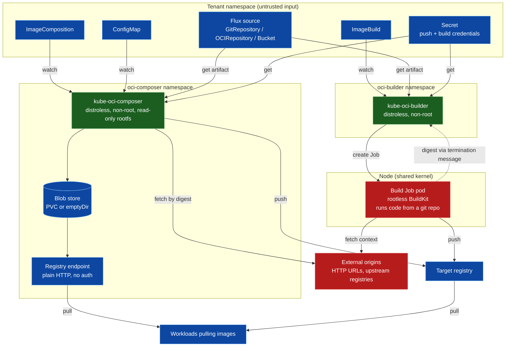
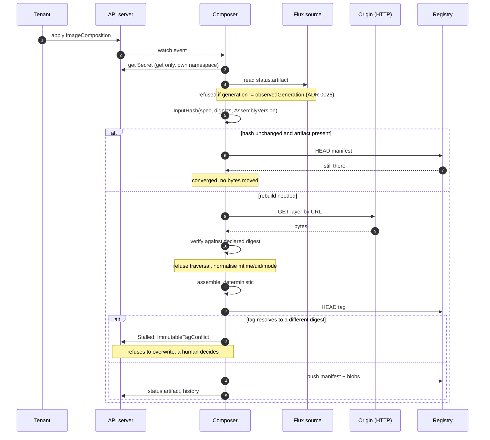
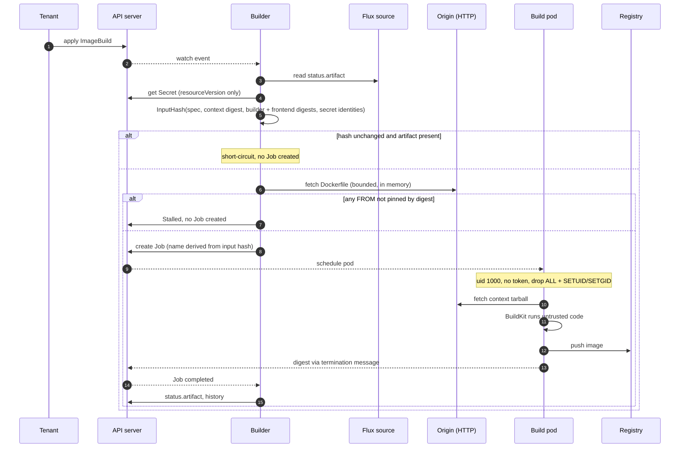

# Threat model

STRIDE over the two components this project ships. Written against the code, not against an
intended design: every claim below names the file that makes it true, so it can be checked and so it
rots visibly when the code moves.

Scope is what this repository controls. The registry, the Flux source controllers, the container
runtime and the cluster's own admission policy are dependencies with their own models; where a
guarantee actually rests on one of them, that is stated rather than assumed.

## Components and trust boundaries

The two components are deliberately separate: separate binaries, charts and RBAC
([ADR 0004](adr/0004-dockerfile-support.md)). Installing the composer does not install the builder,
and the composer's role cannot create a single object.

The boundaries that matter:

| Boundary | Crossing | Why it matters |
|---|---|---|
| **Tenant → controller** | A spec is written by anyone with `create` on the CRD | Spec fields become URLs fetched, images pulled, and Jobs run |
| **Origin → controller** | Fetched tarballs, pulled base images | Attacker-controlled bytes parsed in-process |
| **Controller → build pod** | A Job running BuildKit | The pod executes arbitrary code from a git repository |
| **Store → consumer** | The serve endpoint | Unauthenticated, plain HTTP |
| **Namespace → namespace** | `sourceRef.namespace` | The one place a tenant reaches outside its own namespace |

## The core invariant, and what it buys

`output digest = f(spec)` for `ImageComposition`. Assembly pins mtimes to epoch, forces empty
`uname`/`gname`, normalises modes, sorts entries with `sort.SliceStable`, and discards source-side
gzip metadata (`internal/oci/assemble.go`, `internal/oci/extract.go`).

Security consequence: **content cannot change without the spec changing**, so review of the spec is
review of the artifact. `publish.immutable: true` (the default) refuses to move a tag that already
resolves to different bytes — which is what caught a real incident where a tag was published holding
a previous revision's content ([ADR 0026](adr/0026-a-source-artifact-can-lag-its-own-spec.md)).

For `ImageBuild` the invariant is weaker by construction: the output is an *observation*, not a
function of the spec ([ADR 0025](adr/0025-dockerfile-builds-as-a-second-kind.md)). Rebuilds do
reproduce for builds whose steps are themselves deterministic ([ADR 0027](adr/0027-what-rootless-buildkit-actually-needs.md)),
but a `RUN` that installs packages or reads the clock can still differ. The immutable-tag guard is
therefore load-bearing rather than decorative for this kind.

## S — Spoofing

| # | Threat | Status | Evidence |
|---|---|---|---|
| S1 | A client impersonates the controller and **writes** to the serve endpoint | **Mitigated** | `loopbackWritesOnly` (`internal/serve/writepath.go`) refuses `PUT`/`POST`/`PATCH`/`DELETE` unless the TCP peer is loopback, which means this process. Enforced in the handler rather than left to the deployment. **This row previously read "partially mitigated — depends on deployment", and that was wrong**: the bind address defaults to every interface, the chart exposes it as a Service, the Ingress routes `/v2/` including `PUT`, and there was no authentication — a test confirmed an arbitrary pod's `PUT` returned **201 Created**. ADR 0025:87-90 rested on the same false premise when it said a build Job could not write here. |
| S2 | A registry impersonates the origin of a base image or layer | **Mitigated** | Base images and image layers are pulled by digest only — `name.NewDigest` fails on a tag (`internal/source/image.go`), and the CRD pattern requires `@sha256:`. Fetched layers are verified against the declared digest (`internal/oci/fetch.go`). |
| S3 | A build pushes to a registry impersonating the intended one over plain HTTP | **Mitigated, opt-in per host** | `--insecure-registry` is a list of hosts, matched on the push target's host rather than applied globally (`insecureAttr`, `internal/buildcontroller/job.go`). Naming one internal registry does not downgrade every other push. |

**I5 is now the sharpest item in this section.** Writes are closed, but reads remain anonymous by
design, and the endpoint is HTTP-only — `ListenAndServe`, no TLS anywhere in `internal/serve` — with
the chart's TLS story being an Ingress terminating in front, routing only `/v2/`. In a multi-tenant
cluster a NetworkPolicy is the only thing separating one namespace's artifacts from another's
readers.

The lesson worth keeping from S1: the guarantee had been *written down* in a package comment for a
long time without ever being *implemented*, and nothing tested it. A claim about behaviour is not
behaviour.

## T — Tampering

| # | Threat | Status | Evidence |
|---|---|---|---|
| T1 | Layer content changes without the spec changing | **Mitigated, with one opt-in** | `fetch` carries a declared digest. For `sourceRef`: an artifact that predates its own source's spec is refused (`internal/source/flux.go`, ADR 0026), and `sourceRef.revision` pins the revision a layer expects. The pin is what covers a **branch or semver range**, which moves with no generation bump for the staleness check to see — but it is optional, so a spec that omits it still consumes whatever the source publishes. |
| T2 | A published tag is repointed at different content | **Mitigated by default** | `publish.immutable: true` refuses to move a tag resolving to a different digest. Note the inherent limit: it cannot validate a tag's **first** publish, because there is nothing to compare against. |
| T3 | A malicious archive escapes the target directory on unpack | **Mitigated** | Traversal is refused rather than sanitised (`internal/oci/extract.go`): any entry whose cleaned path is `..` or starts with `../` is an error. Zip entries normalise `\` to `/` **before** the check (`internal/oci/zip.go`). |
| T4 | A build tampers with another build's cache | **Mitigated** | The cache ref is per-object, derived from namespace and name (`cacheRefFor`). A shared cache would be a channel between whoever can write Dockerfiles. |
| T5 | The controller is upgraded to assemble differently, silently | **Mitigated by discipline, not by mechanism** | `AssemblyVersion` is in the input hash so a change rebuilds everything — but it is a constant a human must remember to bump. It has been missed before. |
| T6 | A build pod tampers with the node or other pods | **See E1** | |

## R — Repudiation

| # | Threat | Status | Evidence |
|---|---|---|---|
| R1 | An artifact exists and nobody can say what produced it | **Partially mitigated** | `status.history[].sources` records each layer's name, resolved digest and revision, which is what ADR 0026's incident needed and did not have — it had to be diagnosed by extracting a layer and reading its payload. Still missing: no OCI annotations carry provenance, so the record lives only in the object's status and is lost with it. |
| R2 | A failure leaves no trace after the pod is gone | **Mitigated** | A failed build's Job is kept for the whole backoff so its pod's logs survive; the exit code, reason and termination message are copied into status and raised as an Event. |

R1 is materially better than it was: `status.history[].sources` now records each layer's name,
resolved digest and revision, so *"which source revision produced this digest?"* is answerable from
the API. What is still missing is provenance **in the artifact** — no OCI annotations carry it — so
the answer exists only while the object does.

## I — Information disclosure

| # | Threat | Status | Evidence |
|---|---|---|---|
| I1 | Secret **values** leak through `status.inputHash` | **Mitigated** | Only `name` + `resourceVersion` reach the hash (`internal/buildcontroller/imagebuild_controller.go`). Status is readable by anyone with `get`, and a hash of a low-entropy secret is an oracle. |
| I2 | Secret values leak through build args | **Mitigated** | Secrets are projected via BuildKit's secret mount, never as `--opt build-arg`. Build args *are* hashed, so anything placed there is world-readable by design. |
| I3 | The controller holds credentials it does not need | **Mitigated** | Both roles grant `get` on secrets — never `list` or `watch` — and a chart drift guard fails the build if that ever changes (`TestBuilderChartNeverGrantsSecretListOrWatch`). Push credentials for builds are projected straight into the build pod and never read by the controller. |
| I4 | A tenant reads another namespace's source content | **Mitigated** | A `sourceRef` naming any namespace but the object's own is refused with a terminal error (`internal/controller/resolve.go`), and `ImageBuild.spec.context` the same. It had to be fixed controller-side rather than in CEL: a CRD validation rule cannot read `metadata.namespace`. Both controllers still hold cluster-wide `get;list;watch` on Flux sources, so this rule is the whole of the boundary — which is why it is asserted by tests on both kinds. Secrets and ConfigMaps were never exposed this way; both always resolved against `obj.Namespace`. |
| I5 | Anyone on the network pulls any served image | **NOT mitigated by this code** | The serve endpoint has no authentication. Any client that can reach the Service or NodePort can pull every artifact the composer serves, across all namespaces. |
| I6 | An SSRF via a `fetch` URL reaches cluster-internal services | **NOT mitigated** | `fetch.url` is used to build a request directly (`internal/oci/fetch.go`); there is no allow-list or private-range block. The response must match a declared digest to become a layer, which limits *exfiltration* — but the request itself is still made from the controller's network position. |

I5 is now the sharpest item in this section, and it is deliberate: the endpoint has no
authentication, and restricting who can reach it is the deployment's job. Note what that means in a
multi-tenant cluster — a NetworkPolicy is the only thing separating one namespace's artifacts from
another's readers.

## D — Denial of service

| # | Threat | Status | Evidence |
|---|---|---|---|
| D1 | A huge fetched artifact exhausts memory or disk | **Partially mitigated** | The Dockerfile pre-check is bounded (`maxDockerfileBytes`, `maxContextScan` in `internal/build/context.go`) and never writes to disk. Layer fetches stream to the cache, but there is no per-object size cap. |
| D2 | A build runs forever | **Mitigated** | `spec.timeout` becomes the Job's `ActiveDeadlineSeconds`, enforced by Kubernetes rather than by the controller noticing — so it survives a leader change. |
| D3 | A failing build hot-loops against the API server | **Mitigated** | Capped exponential backoff, and the failed Job is retained until its backoff elapses so that deleting it cannot wake the controller through its own watch. This was a real defect. |
| D4 | Builds exhaust node resources | **Partially mitigated** | `spec.resources` applies to both the build and fetch containers, but is optional; a namespace `ResourceQuota` is the real control and is the cluster's job. |
| D5 | Unbounded history growth in status | **Mitigated** | Rotation is capped by `historyLimit`, and a rebuild reproducing an earlier digest moves that entry rather than adding one. |

## E — Elevation of privilege

| # | Threat | Status | Evidence |
|---|---|---|---|
| E1 | **A build escapes the pod and reaches the node** | **Reduced, not eliminated — accepted** | See below. |
| E2 | A build uses the controller's API credentials | **Mitigated** | `automountServiceAccountToken: false` unless the spec names an identity. A pod running code from a git repository must not carry the token of whatever created it. |
| E3 | Installing the composer implies the ability to run containers | **Mitigated** | The builder is a separate component. ADR 0004 rejected a feature flag: *"a flag set to `false` is a weaker guarantee than a component that does not exist."* The composer's role cannot create a single object. |
| E4 | A tenant escalates by pointing a build at a privileged service account | **Partially mitigated** | `spec.serviceAccountName` is honoured, so a tenant who can create a `ImageBuild` can run a build under any service account **in their own namespace**. That is the same privilege they already have via a Pod, so it is not an escalation — but it is worth stating, because it means the builder inherits the namespace's Pod-creation trust model. |
| E5 | Someone reintroduces `privileged` | **Mitigated by test** | `privileged: false` is asserted for every container in the build pod, and the capability set is asserted **exactly** — `drop: ALL` plus `SETUID`/`SETGID` and nothing else. |

### E1 in detail

The build pod is where untrusted code executes, so it deserves its own statement.

It runs rootless BuildKit as uid 1000, `privileged: false`, no host namespaces, no device access, no
host mounts. It **does** have `allowPrivilegeEscalation: true` and `SETUID`/`SETGID`, and seccomp and
AppArmor unconfined — all four measured as necessary, none of them chosen for convenience
(ADR 0027).

The residual risk, stated plainly: **a setuid binary inside the build image can gain those two
capabilities within the container, and seccomp being unconfined widens the reachable kernel surface.**
That is not host root, and ADR 0001's blast radius — a container with host-level power — is not
reinstated. But builds share the node's kernel, and a kernel vulnerability reachable through an
unconfined seccomp profile is the realistic escape path.

Kubernetes user namespaces (`hostUsers: false`) would remove the need for escalation entirely and
map the container's root to an unprivileged host uid. ADR 0027 records that as the destination; it
did not run on the CI cluster and is not shipped.

**If builds are hostile rather than merely untrusted, run them on dedicated nodes, or behind a
sandboxing runtime such as Kata or gVisor.** That is a cluster decision this project cannot make.

## Sequence: publishing a composition

The security-relevant ordering is that everything is resolved and hashed from the API server
*before* any bytes move, and that the immutable check happens before any tag is written.

## Sequence: running a build

Note step ordering: the pinned-`FROM` check happens **before** a Job exists, so an unpinned base
never reaches execution. The digest returns through the pod's termination message rather than by
granting the controller `pods/exec` or reading logs.

## Assumptions this model rests on

These are not mitigations. They are things assumed true, and each one is somebody else's job.

1. **`create` on `ImageComposition` / `ImageBuild` is a privilege.** A `ImageBuild` runs code, and
   both read every source in their own namespace. Grant them like you grant Pod creation.
2. **The serve endpoint is not exposed with its write path reachable** (S1), and network policy —
   not this code — restricts who can pull (I5).
3. **The registry is durable.** For `ImageBuild`, losing the store or status can mean a rebuild
   producing a digest that conflicts with an already-published immutable tag (ADR 0025).
4. **Nodes running builds are acceptable to share.** See E1.
5. **The cluster enforces `ResourceQuota`** where builds could otherwise exhaust nodes (D4).

## Known gaps, in priority order

| Gap | Threat | Note |
|---|---|---|
| Serve endpoint serves reads anonymously over plaintext | I5 | Deliberate; a kubelet must pull without credentials. Restricting *who* may pull is a NetworkPolicy question. The largest remaining item |
| No SSRF controls on `fetch.url` | I6 | Digest verification limits exfiltration, not reachability. Considered and declined |
| Provenance lives only in status, not in the artifact | R1 | OCI annotations would survive the object; config labels would change the digest |
| `sourceRef.revision` is opt-in | T1 | A spec that omits it still consumes whatever the source publishes |
| `AssemblyVersion` is a human discipline | T5 | Has been missed |
| Build pods share the node kernel with seccomp unconfined | E1 | User namespaces are the destination (ADR 0027) |

## Reviewing this document

It is written against code, so it goes stale when the code moves. The claims most worth re-checking
are the RBAC verbs, the build pod's security context, and the namespace used for each reference —
those three carry most of the model. All are asserted by tests, so a change that invalidates a claim
here should also turn a test red.
